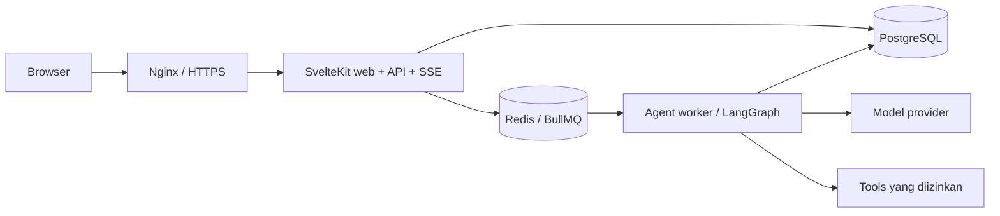

# Stack dan arsitektur

Perluasan MVP autonomous: [struktur divisi, koordinasi multi-agent, kontrak tambahan, dan kontrol owner](09-autonomous-company.md). Aturan dasar di bawah tetap berlaku untuk setiap parent/child run.


## Stack baseline

| Komponen | Pilihan | Catatan |
|---|---|---|
| Web/server API | SvelteKit + TypeScript | Satu aplikasi untuk UI dan endpoint |
| Styling | Tailwind CSS + komponen Svelte | Pemilihan library komponen setelah review desain |
| Runtime/tooling | Bun | Target; diuji pada image Linux produksi |
| Database | PostgreSQL + Drizzle | Migrasi versioned; constraint database wajib |
| Validasi | Zod | Input API, konfigurasi, dan kontrak tool |
| Agent worker | TypeScript + LangGraph JS | Proses/container terpisah dari web |
| Queue | Redis + BullMQ | Dispatch dan concurrency pekerjaan |
| Streaming | SSE | Progress server ke browser; aksi browser melalui HTTP |
| Deployment | Docker Compose + Nginx | HTTPS, volume persisten, healthcheck |
| Auth | Belum dipilih | Evaluasi library sesuai SvelteKit, Bun, dan metode login |

## Hubungan layanan



Web membaca event persisten untuk SSE; Redis notification bisa ditambahkan sebagai optimasi. Database menjadi sumber status kanonis. LangGraph menyimpan checkpoint persisten di PostgreSQL dengan namespace/schema terpisah dari tabel domain.

## Struktur repo usulan

```text
apps/web/                 SvelteKit
apps/worker/              queue consumers, recovery, graph invocation
packages/contracts/       schemas, types, event definitions
packages/db/              schema domain dan migrations
packages/agents/          graphs, provider adapters, tool registry
packages/config/          validasi environment
infra/                    Dockerfiles, Compose, Nginx
docs/                     dokumentasi
```

Package server tidak boleh terimpor ke bundle browser. Secret hanya dibaca server/worker. Gunakan Bun workspaces dan lockfile yang di-commit. TypeScript tetap diperiksa dengan typecheck; eksekusi TypeScript oleh runtime tidak menggantikan pemeriksaan tipe.

## Keputusan arsitektur

1. **Satu repo, web dan worker terpisah.** Memudahkan berbagi kontrak; pekerjaan model tidak menahan HTTP request panjang.
2. **LangGraph untuk langkah agent; BullMQ untuk dispatch.** Graph mengatur state, pause, dan branch; queue mengatur job yang dapat dijalankan worker. Tidak ada dua mesin retry yang mengulang tindakan tanpa koordinasi.
3. **PostgreSQL menyimpan state domain dan outbox.** Pembuatan run dan event outbox dilakukan dalam transaksi yang sama. Dispatcher mempublikasikan job; crash setelah publish dapat menyebabkan publish ulang, sehingga job consumer harus idempotent.
4. **API provider eksternal untuk MVP.** Model lokal menunggu informasi kapasitas server dan kebutuhan produk.
5. **Bun adalah target yang harus dibuktikan.** Uji build SvelteKit, server adapter, streaming, queue, driver database, LangGraph checkpointer, shutdown, dan SDK provider. Jika gagal, pilih adapter yang terpelihara dan kompatibel atau jalankan komponen terdampak di Node.js; bahasa tetap TypeScript.

## Batas implementasi

Library LangGraph dapat dijalankan sendiri; layanan deployment/tracing komersial tidak menjadi dependency wajib. Pemilihan library tidak otomatis menyediakan auth, isolasi tenant, approval policy, scheduler, atau pencatatan biaya. Semua itu tetap bagian aplikasi.

## Referensi resmi

- [SvelteKit adapter-node](https://svelte.dev/docs/kit/adapter-node)
- [SvelteKit dengan Bun](https://bun.sh/guides/ecosystem/sveltekit)
- [Kompatibilitas Node.js di Bun](https://bun.sh/docs/runtime/nodejs-compat)
- [LangGraph JavaScript](https://docs.langchain.com/oss/javascript/langgraph/overview)
- [BullMQ](https://docs.bullmq.io/)
- [PostgreSQL row security](https://www.postgresql.org/docs/17/ddl-rowsecurity.html)

Referensi ditinjau pada 27 September 2026. Nomor versi final dan hasil pengujian integrasi dicatat pada fase 0.
