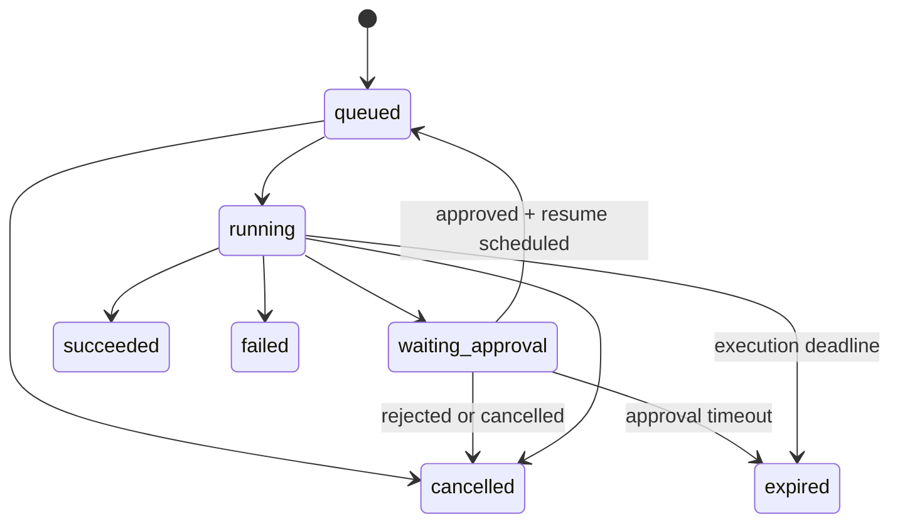

# Eksekusi agent dan approval

Perluasan MVP autonomous: [struktur divisi, koordinasi multi-agent, kontrak tambahan, dan kontrol owner](09-autonomous-company.md). Aturan dasar di bawah tetap berlaku untuk setiap parent/child run.

## State machine

Status pending/running pada queue tidak menggantikan state domain. Semua transisi memakai pemeriksaan state/version atomik. Hanya satu worker boleh memajukan thread run yang sama; gunakan lease/claim dengan fencing token atau mekanisme ekuivalen yang diuji.

## Graph MVP

`load_context → plan → validate_action → approval_if_required → execute_tool → evaluate → finalize`

Evaluate boleh mengulangi langkah dengan batas jumlah step, tool call, token, waktu, dan biaya. Batas numerik final dipilih saat uji provider. Tidak boleh ada loop tanpa batas. Instruksi, model, daftar tools, limits, dan graph version dibekukan pada snapshot run.

## Siklus pekerjaan

1. API memvalidasi membership, task, konfigurasi agent, dan batas workspace.
2. Dalam satu transaksi, buat run, event awal, dan outbox dispatch.
3. Dispatcher mengirim job dengan ID deterministik. Worker memuat status kanonis dan mengambil claim run; job duplikat tidak mengulang run terminal.
4. Worker menjalankan graph menggunakan thread ID internal unik yang dipetakan ke workspace/run. Client tidak boleh memilih thread ID secara bebas.
5. Checkpointer persisten menyimpan graph state. Domain event menyimpan progress yang aman untuk UI.
6. Saat interrupt approval terjadi, worker menyelesaikan job saat ini dan run menjadi waiting_approval; proses tidak perlu menunggu aktif.
7. Keputusan approved menghasilkan outbox resume. Worker memuat checkpoint yang sama dan melanjutkan dengan `Command({resume: ...})`.
8. Hasil akhir dan usage dipersistenkan. Reconciler memeriksa run macet/outbox tertunda setelah restart.

## Autonomous dan delegasi

Policy memutuskan allow/require_approval/deny sebelum tindakan. Allow berjalan otomatis; approval hanya untuk require_approval. Parent menunggu child melalui state persisten dan melepas worker; child result memicu resume. Gunakan root budget bersama dan propagasi cancel. Jalur task tunggal di bawah menjadi unit eksekusi setiap specialist; detail lintas-agent ada di dokumen autonomous.

## Approval

Approval menyimpan nama dan versi tool, input yang ditinjau atau hash kanonisnya, target resource, policy version, action key, requester, dan expires_at. UI menampilkan tindakan konkret yang akan dilakukan.

Saat resume, periksa workspace, permission approver, expiry, status pending/approved yang sesuai, dan kecocokan action hash. Perubahan argumen atau kebijakan yang relevan mengharuskan approval baru. Approval tidak memberikan izin di luar hak workspace/tool policy.

LangGraph menjalankan ulang node yang terinterupsi dari awal saat resume. Karena itu, side effect sebelum `interrupt()` harus dihindari atau dibuat idempotent. Tempatkan eksekusi tindakan setelah gate approval, idealnya di node terpisah. [Dokumentasi interrupts](https://docs.langchain.com/oss/javascript/langgraph/interrupts)

## Retry dan efek eksternal

- Retry otomatis hanya untuk kegagalan sementara yang diklasifikasikan, misalnya rate limit atau koneksi gagal, memakai backoff, jitter, dan batas percobaan.
- Invalid input, permission denied, dan credential salah tidak diulang tanpa perubahan.
- Setiap tindakan memiliki action key persisten. Gunakan idempotency key pada layanan eksternal jika tersedia.
- Jika proses mati setelah layanan eksternal sukses tetapi sebelum hasil lokal disimpan, hasilnya bisa ambigu. Lakukan rekonsiliasi memakai external reference; bila tidak mungkin, tandai perlu pemeriksaan manusia dan hindari replay otomatis tindakan tersebut.
- Retry oleh pengguna atas run failed membuat run baru yang menautkan run sebelumnya. Resume approval tetap memakai run/thread yang sama.
- Pengiriman queue bersifat at-least-once. Checkpoint tidak menjamin side effect eksternal exactly-once.

## Cancel, budget, dan tools

Cancel bersifat kooperatif: periksa flag sebelum setiap node/tool dan abort request yang mendukungnya. Tindakan eksternal yang telah sukses tidak otomatis dibatalkan.

Periksa budget sebelum panggilan model/tool dan catat usage sesudahnya. Batasi output token dan concurrency; penggunaan in-flight dapat membuat biaya melampaui estimasi sehingga jangan menjanjikan hard cap absolut tanpa mekanisme reservasi yang diuji. Harga disimpan sebagai snapshot; usage yang tidak dilaporkan tetap unknown.

Tools memakai schema input/output, timeout, permission, redaction, dan deklarasi apakah memiliki side effect. Content dari dokumen, model, atau tool dianggap data tidak tepercaya, bukan sumber otorisasi. MCP masuk fase lanjutan dengan allowlist server/tool dan pengelolaan credential. Agent tidak memperoleh akses Docker socket, host filesystem, atau shell umum pada MVP.

## Observability

Hubungkan request ID, workspace ID, run ID, job ID, graph version, tool execution ID, dan provider request ID. Catat durasi, retry, error code, queue lag, usage, serta status approval. Simpan ringkasan tindakan untuk audit, bukan chain-of-thought internal.
